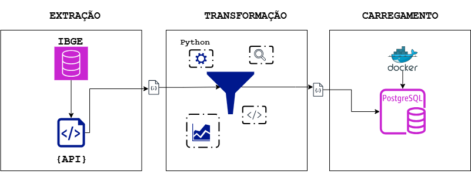
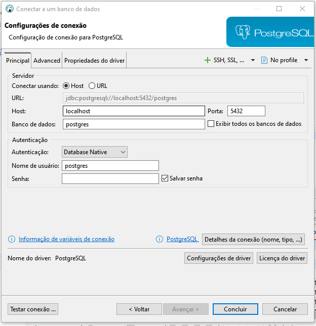

# Teste de Engenharia de Dados ETL IBGE.

### **Objetivo:** Desenvolver uma aplicação em **Python** capaz de:

1. **Consumir dados públicos** da API do IBGE referentes a três indicadores:
    - Chegada de Turistas
    - Gastos públicos com Educação
    - Gastos públicos com Saúde
2. **Filtrar os dados apenas para os países abaixo**:
    - Brasil, Argentina, Uruguai, Espanha, Alemanha, Itália, Estados Unidos, México, Canadá, China, Japão, Nova Zelândia, Austrália, Argélia, Egito, África do Sul
3. **Normalizar os dados** retornados em formato JSON e armazená-los em três tabelas distintas de um banco de dados **PostgreSQL**, utilizando **Docker**.

# 1º Passo: Montar a arquitetura do projeto ETL.

 

# 2º Passo: Desenvolvendo a extração dos dados do IBGE e retornando em Json.

Nesta aplicação, será desenvolvida a parte de extração dos dados. Para extrairmos os dados, foi consutada a 
api publica do IBGE conforme o link: https://servicodados.ibge.gov.br/api/docs/paises#api-acervo

Nesta API, iremos extrair duas informações: Paises e Indicadores. Dentro dos indicadores, teremos 3 dados importantes. São eles: 

- Chegada de Turistas
- Gastos públicos com Educação
- Gastos públicos com Saúde

Os paises serão os seguintes:

Brasil, Argentina, Uruguai, Espanha, Alemanha, Itália, Estados Unidos, México, Canadá, China, Japão, Nova Zelândia, Austrália, Argélia, Egito, África do Sul

O retorno que preciso ter em Json: https://servicodados.ibge.gov.br/api/v1/paises/AR%7CBR/indicadores/77819%7C77820


# O que foi feito:

- Requisitando as informações da API.

```python

import requests

url = "https://servicodados.ibge.gov.br/api/v1/paises"

```
# Criado uma função que busca os dados necessários da API.

```python

def busca_dados(paises, indicadores):
    """
    Esta função busca os dados da API do IBGE para os países e indicadores especificados.

    Quais regras de negócio foram implementadas:
    - Consulta a API do IBGE para obter dados de países e indicadores.
    - Tratamento de erros para requisições HTTP.
    - Retorno dos dados em formato JSON.
    - Argumentos para especificar países e indicadores.
    - Requisições para extrair os dados necessários, com status e tempo limite.
    - Utilizando fstring para formatar a URL, setando os parâmetros paises e indicadores.
    """
    adress = f"{url}/{paises}/indicadores/{indicadores}" 
    response = requests.get(adress, timeout=5)
    response.raise_for_status()
    return response.json()

```

# 3º Passo: Normalizando e tabulando os dados em um DataFrame.

- Importando a biblioteca pandas para tratar os dados e normalizá-los em um dataframe.

```python

import pandas as pd

```

- Criando uma função que basicamente irá tabular meus dados de acordo com os parâmetros indicadores e paises.
- Iterando nos dados_json extraidos da api, para cada indicador, percorrendo as series por pais.
- Os dados estão sendo tratados por indicadores que estarão na estrtuturação final: pais, indicador, ano, valor.
- retorna o dataframe com registros e a quantidade de dados normalizados.

```python
def normaliza_dados(dados_json):
    """
    Normaliza os dados da API IBGE para DataFrame.
    Estrutura final: pais, indicador, ano, valor
    """
    registros = []
    for item in dados_json:
        indicador = item.get("indicador")
        for serie in item.get("series", []):
            pais = serie["pais"]["id"]
            for ano_valor in serie.get("serie", []):
                for ano, valor in ano_valor.items():
                    # Ignorando anos inválidados e valores ausentes
                    if ano.isdigit() and valor not in ("", "-", None):
                        try:
                            registros.append({
                                "pais": pais,
                                "indicador": indicador,
                                "ano": int(ano),
                                "valor": float(valor)
                            })
                        except ValueError:
                            # Ignora valores que não são conversíveis.
                            continue
    df = pd.DataFrame(registros)
    print(f"[INFO] Registros normalizados: {len(df)}")
    return df

```
# 4º Passo: Inserção e carregamento do dados no postgres

- Neste trecho estaremos carregando e criando tabelas para o banco de dados.

- Importando as bibliotecas que serão utilizadas:

```python
import os
from sqlalchemy import create_engine, text
import pandas as pd

```
- Configuração de conexão com o banco de dados postgres

```python
# Configuração de conexão

DB_USER = os.getenv("POSTGRES_USER", "postgres")
DB_PASSWORD = os.getenv("POSTGRES_PASSWORD", "ibge1234")
DB_HOST = os.getenv("POSTGRES_HOST", "localhost")  # ou "postgres" se for dentro do docker
DB_PORT = os.getenv("POSTGRES_PORT", "5441")
DB_NAME = os.getenv("POSTGRES_DB", "ibge_db")

DATABASE_URL = f"postgresql+psycopg2://{DB_USER}:{DB_PASSWORD}@{DB_HOST}:{DB_PORT}/{DB_NAME}"
engine = create_engine(DATABASE_URL)

```

-  Criando as tabelas no postgres: dados, paises e indicadores:

```python

def criar_tabelas():
    """
    Cria as tabelas caso não existam.
    """
    with engine.begin() as conn:
        # Tabela indicadores
        conn.execute(text("""
            CREATE TABLE IF NOT EXISTS indicadores (
                id SERIAL PRIMARY KEY,
                nome VARCHAR(255) UNIQUE NOT NULL
            );
        """))

        # Tabela paises
        conn.execute(text("""
            CREATE TABLE IF NOT EXISTS paises (
                id SERIAL PRIMARY KEY,
                nome VARCHAR(100) UNIQUE NOT NULL
            );
        """))

        # Tabela dados
        conn.execute(text("""
            CREATE TABLE IF NOT EXISTS dados (
                id SERIAL PRIMARY KEY,
                pais_id INT NOT NULL REFERENCES paises(id),
                indicador_id INT NOT NULL REFERENCES indicadores(id),
                ano INT NOT NULL,
                valor NUMERIC NOT NULL
            );
        """))
    print("[INFO] Tabelas criadas com sucesso!")

```

- Salvando o dataframe e inserindo os dados:

```python

def salvar_dataframe(df: pd.DataFrame):
    """
    Salva os dados normalizados nas três tabelas: paises, indicadores e dados.
    
    dataframe com as colunas: ['paises', 'indicadores', 'ano', 'valor']
    """
    # Insere os países
    with engine.begin() as conn:
        paises = df['pais'].unique()
        for pais in paises:
            conn.execute(
                text("INSERT INTO paises (nome) VALUES (:nome) ON CONFLICT (nome) DO NOTHING"),
                {"nome": pais}
            )

    # Insere os indicadores
    with engine.begin() as conn:
        indicadores = df['indicador'].unique()
        for ind in indicadores:
            conn.execute(
                text("INSERT INTO indicadores (nome) VALUES (:nome) ON CONFLICT (nome) DO NOTHING"),
                {"nome": ind}
            )

    # Mapea os Id's e isere os dados
    with engine.begin() as conn:
        pais_map = dict(conn.execute(text("SELECT nome, id FROM paises")).fetchall())
        indicador_map = dict(conn.execute(text("SELECT nome, id FROM indicadores")).fetchall())

        # substitui os paises e indicadores peos id's
        df['pais_id'] = df['pais'].map(pais_map)
        df['indicador_id'] = df['indicador'].map(indicador_map)

        df_final = df[['pais_id', 'indicador_id', 'ano', 'valor']]

        # Insere dados nas tabelas
        df_final.to_sql("dados", engine, if_exists="append", index=False)
        print(f"[INFO] Inseridos {len(df_final)} registros na tabela dados.")


```

# 5º Passo: Chamando o ETL na main.py para testar as instâncias.

- Neste passo, estou instanciando minhas funções para testar o ETL.

```python

from src.extract_api import busca_dados
from src.normalize import normaliza_dados
from src.database import criar_tabelas, salvar_dataframe

dados_paises = "BR|AR|UY|ES|DE|IT|US|MX|CA|CN|JP|NZ|AU|DZ|EG|ZA"
dados_indicadores = "77818|77819|77820"

if __name__ == "__main__":
    # 1. Extrai os Dados
    dados = busca_dados(dados_paises, dados_indicadores)
    print(dados)

    #2 Normaliza os Dados
    df = normaliza_dados(dados)

    #3 Mostra os resultados
    print(df.head())
    
    #4 Insere no banco de dados e salva.
    criar_tabelas()
    salvar_dataframe(df)


```

# Como executar o código:

- Criando o docker-compose.yml

```yml

version: "3.9"

services:
  postgres:
    image: postgres:17
    container_name: ibge_postgres
    restart: always
    environment:
      POSTGRES_USER: ${POSTGRES_USER}
      POSTGRES_PASSWORD: ${POSTGRES_PASSWORD}
      POSTGRES_DB: ${POSTGRES_DB}
    ports:
      - "${POSTGRES_PORT}:5432"

  etl:
    build: .
    container_name: ibge_etl
    depends_on:
      - postgres
    environment:
      POSTGRES_USER: ${POSTGRES_USER}
      POSTGRES_PASSWORD: ${POSTGRES_PASSWORD}
      POSTGRES_DB: ${POSTGRES_DB}
      POSTGRES_HOST: postgres
      POSTGRES_PORT: 5432


```

- Criando a imagem do Docker:

```dockerfile
#imagem
FROM python:3.13-slim

#diretório
WORKDIR /app

#requirements
COPY requirements.txt .
RUN pip install --no-cache-dir -r requirements.txt

# Copia o código fonte
COPY src/ ./src/

# Comando padrão para rodar o container docker
CMD ["python", "-m", "src.main"]

```

# Como executar o ETL via Docker:

No terminal, dê o seguinte comando para criar o conatiner:
```
docker-compose build

```
E crie a imagem:

```
docker-compose up

```
# Crie as conexões no banco:

- Usando o Dbeaver, crie uma conexão para o postgres, especificando a porta, usuário, senha e nome do banco. Abaixo segue a ilustração:




# Fontes e Referências:

- https://stackoverflow.com/questions/5500332/cant-connect-the-postgresql-with-psycopg2

- https://www.datacamp.com/tutorial/tutorial-postgresql-python

- https://docs.docker.com/compose/

- https://docs.docker.com/compose/install/

- https://hub.docker.com/

- https://www.youtube.com/watch?v=vrglmtlPTek&t=990s

- https://www.youtube.com/watch?v=vPMHgiN6row

- https://www.youtube.com/watch?v=Je6tCJPXRuk&t=462s

- https://www.youtube.com/watch?v=AKjf74tS__Y

- https://www.youtube.com/watch?v=9jqFq3muxRU

- https://www.youtube.com/watch?v=xvCwZ73muV8&t=521s

- https://docs.sqlalchemy.org/en/20/dialects/postgresql.html#module-sqlalchemy.dialects.postgresql.psycopg2

- https://code.visualstudio.com/docs/languages/markdown

# Autor:

- Desenvolvido por Moyses.

- Obs: Fique a vontade para clonar ou forkar.